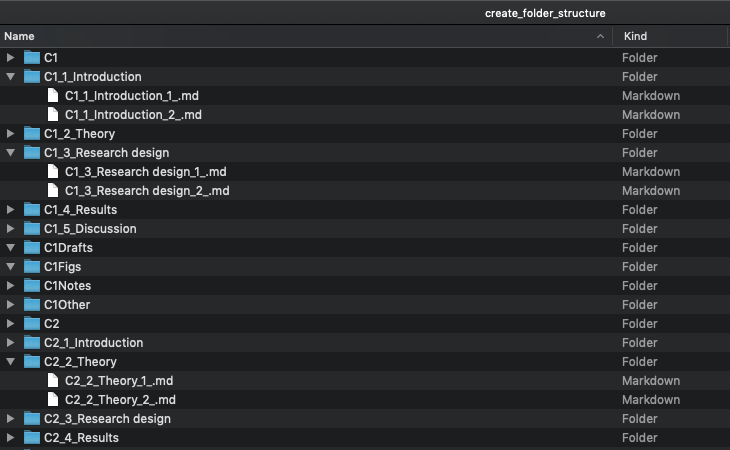
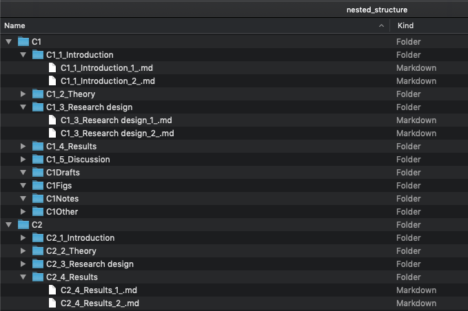

# nested_markdown_filing
The included python script (`folder_structure.py`) is used to create a nested set of folders containing markdown files, patterned after the sections of an academic paper. Alternatively, use may simply use the folder-file contained within the `nested_structure` directory.

## Customization
All major default customizations for the file-folder structure can be edited in lines 11-15 of `folder_structure.py`:

- `chapters` integer input indicating number of top-level folders (e.g., chapters)
- `chapter_prefix` string input for top-level folder prefix
- `sections` list of strings indicating names for major second-level folders (e.g., sections)
- `sup_sec` list of strings indicating names for minor second-level folders (e.g., drafts/supplementals)

## Script Output

The structure produced by the python script is flat. That is, all folders and sub-folders are output to the script's working directory. You can either use the flattened (default) or a nested version of the folder structure. The  included pre-generated file-folder structure has been nested from the default output.

Either the flattened or the nested file-folder setup works perfectly with my with my [nested_md_to_PDF](https://github.com/joshuascriven/nested_md_to_PDF/tree/master) tool to combine and compile markdown files from every folder into a combined PDF (while specifically ignoring `sup_sec` folder files). 

### Flattened

### Nested

## Naming Convention
Files and folders are named using underscores and numeral prefixes to maintain an order that corresponds across both flattened and nested setups. This convention allows for files to be sorted lexicographically for easy reading/editing using our file browser or importing into the [nested_md_to_PDF](https://github.com/joshuascriven/nested_md_to_PDF/tree/master) tool.

## `sup_sec` Folders
For `sup_sec` folder files do not follow the convention explained above, and subsequently appear last in a name-sorted file browser window. Breaking the convention also allows these files to be ignored in the creation of placeholder markdown files created by `folder_structure.py` and ignored by the [nested_md_to_PDF](https://github.com/joshuascriven/nested_md_to_PDF/tree/master) tool. The effective violation of the convention is maintained by omitting the underscore "_" from the folder name, as in the default case.
